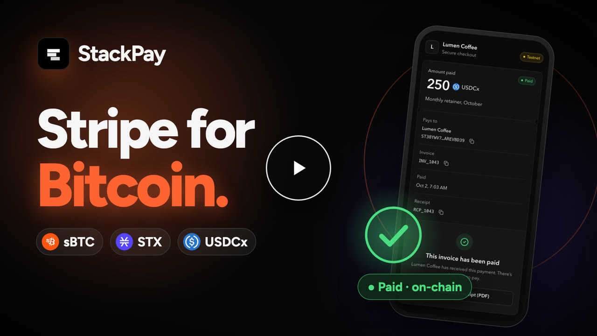

# StackPay

**Bitcoin-native payments for developers and merchants, built on Stacks.**

StackPay lets businesses accept **sBTC**, **STX**, and **USDCx** through hosted checkout, reusable payment links, QR codes, and a versioned REST API. Payments settle on-chain to the merchant's balance and are verified against the Stacks blockchain before they are recorded.

[](https://youtu.be/dcz9mq1vNf4)
[](https://www.npmjs.com/package/stackpay)
[](https://github.com/Psalmuel01/stackpay/actions/workflows/ci.yml)


**Live app:** [stackpay.vercel.app](https://stackpay.vercel.app) · **Demo:** [youtu.be/dcz9mq1vNf4](https://youtu.be/dcz9mq1vNf4)

## Demo

[](https://youtu.be/dcz9mq1vNf4)

<p align="center"><em>Click to watch the demo on YouTube.</em></p>

---

## Contents

- [Demo](#demo)
- [Features](#features)
- [How it works](#how-it-works)
- [Quick start for developers](#quick-start-for-developers)
- [Architecture](#architecture)
- [Repository structure](#repository-structure)
- [Local development](#local-development)
- [Testing](#testing)
- [Deployment](#deployment)
- [Documentation](#documentation)
- [Security](#security)
- [License](#license)

## Features

### Accept payments
- **Hosted checkout:** share a link or QR code. Customers pay from Leather or Xverse, and no account is needed.
- **Three assets:** sBTC (Bitcoin on Stacks), STX, and USDCx, with exact amounts down to each token's base unit.
- **Invoices:** single-use payment requests with an expiry, receipts, and downloadable PDF receipts.
- **MultiPay links:** reusable checkouts with fixed or suggested prices, an optional SKU, and a return URL.
- **Universal QR:** one permanent QR code where customers choose the amount.
- **Counter Mode:** a point-of-sale screen for in-person sales. Each sale has a fixed amount the customer can't change.
- **Refunds:** full or partial refunds from the merchant's wallet to the original payer. Each refund is verified on-chain.

### Build on it
- **REST API (`/api/v1`):** invoices, payment links, receipts, refunds, settlements, events, and reconciliation reports.
- **API keys:** scoped, rotatable secret keys, stored only as hashes and bound to the network (`sk_test_` or `sk_live_`).
- **Idempotency:** safe retries with `Idempotency-Key`, so a network timeout never creates a duplicate.
- **Signed webhooks:**
  - events such as `invoice.paid` and `invoice.refunded`, signed with HMAC-SHA256;
  - retries at 1m, 5m, 30m and 2h, with delivery history and one-click replay.
- **TypeScript SDK:** [`stackpay` on npm](https://www.npmjs.com/package/stackpay). It is typed, and adds automatic idempotency keys, safe retries, pagination, and webhook verification.

### Run it with confidence
- **On-chain verification:** every payment, refund, and withdrawal is checked against the exact chain transaction before it is recorded.
- **Durable event processing:**
  - Chainhook events land in a durable inbox and are projected atomically;
  - reorganized blocks are rolled back and reported.
- **Reconciliation:** a CSV export that links orders to invoices, payments, receipts, and refunds.
- **Operations:**
  - health and readiness probes, metrics with alerts, and structured logs with redaction;
  - production refuses to start with an incomplete configuration.

## How it works

```
Customer wallet ──pays──▶ Stacks contracts (arch / proc) ──events──▶ Hiro Chainhook
                                                                        │
Merchant console ◀── StackPay (Next.js + PostgreSQL) ◀──────────────────┘
                              │
                              └──signed webhooks──▶ Merchant's backend
```

1. A merchant creates an invoice in the console, or through the API or SDK. The customer opens the hosted checkout.
2. The customer's wallet pays the StackPay processor contract. The contract accepts only the invoice's exact amount and asset.
3. StackPay confirms the payment in two ways:
   - **from checkout**, by verifying the exact transaction;
   - **from a Hiro Chainhook**, which covers customers who close the tab.

   Whichever arrives first records the payment, once.
4. The invoice is marked paid and a receipt is issued. The merchant is notified in the console and by webhook.
5. Funds accrue to the merchant's balance in the processor contract and are withdrawn from **Settlements**.

StackPay never holds private keys, and payments never pass through its servers.

## Quick start for developers

```bash
npm install stackpay
```

```ts
import { StackPay } from "stackpay";

const stackpay = new StackPay({
  secretKey: process.env.STACKPAY_SECRET_KEY,   // from Console → Developer → API keys
  baseUrl: "https://stackpay.vercel.app",
});

const invoice = await stackpay.invoices.create({
  amount: "25",
  currency: "USDCx",
  metadata: { order_id: "382" },
});

redirect(invoice.checkout_url); // the customer pays on StackPay's hosted checkout
```

To fulfil orders, verify incoming webhooks against the raw request body:

```ts
export async function POST(request: Request) {
  const event = stackpay.webhooks.constructEvent(
    await request.text(),
    request.headers.get("x-stackpay-signature"),
    process.env.STACKPAY_WEBHOOK_SECRET!,
  );
  if (event.type === "invoice.paid") await fulfil(event.data.object.metadata.order_id);
  return new Response(null, { status: 200 });
}
```

The full API and webhook reference is at [stackpay.vercel.app/docs](https://stackpay.vercel.app/docs#api). The SDK reference is in [`packages/sdk`](packages/sdk).

## Architecture

| Layer | Technology |
| --- | --- |
| Web app and API | Next.js 15 (App Router), React 19, TypeScript, Tailwind CSS |
| Data | Supabase (PostgreSQL). Financial state changes run inside atomic SQL functions. |
| Smart contracts | Clarity on Stacks: `arch` (invoices and links) and `proc` (payments and balances) |
| Chain data | Hiro Stacks API and Hiro Chainhooks |
| Wallets | Leather and Xverse via `@stacks/connect`. Merchants sign in by signing a message. |
| SDK | TypeScript, zero runtime dependencies |

## Repository structure

```
apps/web/                  Next.js app: console, hosted checkout, /api/v1, Chainhook receiver, job runner
packages/sdk/              TypeScript SDK (published as `stackpay`)
packages/contracts/        Clarity contracts and simnet tests
packages/config/           Shared network and environment helpers
supabase/migrations/       Database schema and SQL functions
supabase/tests/            SQL test suites
scripts/                   Database test harness, deployment checker, demo webhook receiver
docs/                      Runbooks, architecture decisions, and design notes
```

## Local development

### Prerequisites
- Node.js 22 (20.x also works)
- A Supabase project, or Docker for a local Supabase
- A Stacks testnet wallet (Leather or Xverse) with testnet STX
- PostgreSQL 15, only for the database test suite

### Setup

```bash
npm install
cp apps/web/.env.example apps/web/.env.local   # then fill in the values
```

Set the database, network, and contract values in `apps/web/.env.local`. Every variable is described in [`apps/web/.env.example`](apps/web/.env.example) and the [operations runbook](docs/operations.md#1-configuration).

Then prepare the database:

```bash
# Local Supabase
npm run supabase:start && npm run supabase:db:reset

# …or a hosted project
npx supabase link --project-ref <project-ref>
npm run supabase:db:push
```

Then start the app:

```bash
npm run dev            # http://localhost:3000
```

To test webhooks locally, run the demo receiver and register `http://localhost:4242/webhooks` in **Developer → Webhooks**:

```bash
STACKPAY_WEBHOOK_SECRET=<endpoint secret> npm run webhook:listen
```

The [development guide](docs/development.md) covers what can and can't run on `localhost`.

## Testing

```bash
npm run test:web          # web app: routes, services, security (Vitest)
npm test -w stackpay      # SDK
npm run test:contracts    # Clarity contracts (Clarinet simnet)
PG_BIN=/opt/homebrew/opt/postgresql@15/bin npm run test:db   # every migration and SQL suite on a throwaway PostgreSQL 15
npm run build             # production build
```

CI runs the web, SDK, contract, and database suites on every push.

## Deployment

StackPay deploys as a standard Next.js app (for example, on Vercel) backed by Supabase. A production deployment needs four things:

1. **Migrations** applied to the Supabase project.
2. **Environment variables** set. Production refuses to start without the required values.
3. **A Hiro Chainhook** for the `arch` and `proc` contracts, posting to `/api/webhooks/chainhooks`.
4. **A scheduled job** calling `/api/internal/jobs` every minute, for example with Supabase `pg_cron`.

The [operations runbook](docs/operations.md) has step-by-step instructions, monitoring, alerts, and incident procedures.

## Documentation

| Topic | Link |
| --- | --- |
| Product docs, API and webhook reference | [/docs](https://stackpay.vercel.app/docs) |
| SDK | [packages/sdk](packages/sdk) |
| Operations runbook | [docs/operations.md](docs/operations.md) |
| Development guide | [docs/development.md](docs/development.md) |
| Settlement design (ADR) | [docs/adr/0001-settlement-model.md](docs/adr/0001-settlement-model.md) |
| Contract deployments | [docs/stackpay-deployment-registry.md](docs/stackpay-deployment-registry.md) |
| Testnet redeployment | [docs/testnet-redeployment.md](docs/testnet-redeployment.md) |
| Merchant pilot plan | [docs/pilot-runbook.md](docs/pilot-runbook.md) |
| Architecture audit and roadmap | [audit](docs/stackpay-v2-audit.md) · [issues](docs/stackpay-v2-issues.md) · [plan](docs/stackpay-v2-implementation.md) |

## Security

- **Merchant sign-in:** merchants sign in with a wallet signature, and the resulting session can be revoked on all devices.
- **API keys:** stored only as hashes, and scoped per permission.
- **Webhook secrets:** encrypted at rest. Deliveries are protected against SSRF.
- **Financial records:** created only after the corresponding on-chain transaction has been verified.

StackPay currently runs on **Stacks testnet**. The smart contracts have not yet been independently audited, so do not use them with mainnet funds until an audit is complete.

To report a vulnerability, open a private security advisory on GitHub rather than a public issue.

## License

The TypeScript SDK in [`packages/sdk`](packages/sdk) is released under the [MIT License](packages/sdk/LICENSE).
