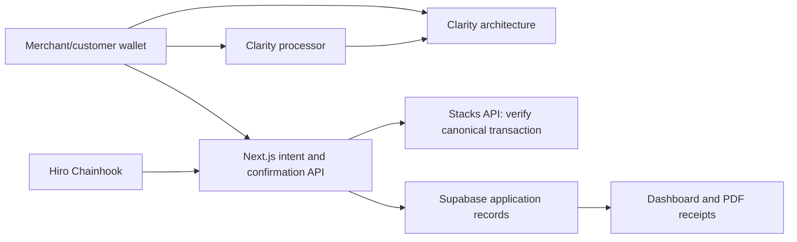

# StackPay v2 architecture audit

Audit date: 2026-09-27. Repository baseline: `d182b23` (following wallet hardening `508c96b` and `cc7655d`). Existing uncommitted wallet/notification keyboard changes are unrelated and preserved. This is a source audit, not an independent contract security assessment or production-readiness certification.

## Executive findings

1. **Merchant cryptographic authentication already exists.** Do not rebuild it or replace opaque sessions with JWTs merely to match another product. All active merchant mutations inspected call `requireMerchant`, derive the wallet from its server session, and reject conflicting caller identities.
2. **Public data disclosure is still a P0.** Public invoice reads return complete invoice rows, including customer name/email. Public confirmation responses also return complete invoice rows. Public PDFs contain customer and merchant contact details. Chain IDs contain timestamps/counters and are not confidential access tokens.
3. **Chainhook ingestion is not a durable event processor.** It records delivery keys, but duplicates still run side effects; rollback only records an event; a batch containing rollback labels all extracted apply events as rollback. `processed_at` is set before processing succeeds.
4. **Deployment isolation is not implemented end to end in this checkout.** Invoice/receipt IDs are globally unique without network/contract scope. Existing transaction verification uses current configuration, so upgrades can orphan old links and collide across deployments. Earlier conversational claims of complete deployment scoping do not match this source.
5. **The desired API is blocked by a signing decision.** `create-invoice` takes merchant identity from `tx-sender`. A server API key cannot manufacture the merchant signature. A v1 API must expose a draft/intent workflow initially, or a separately reviewed contract authorization/payment-request design must precede one-call payable invoice creation.
6. **The processor has limited demonstrated differentiation.** It accumulates per-merchant balances and permits manual withdrawal to another principal. There is no batching, split routing, fee abstraction, conversion, or scheduled payout in these contracts.
7. **Developer features are scaffolding.** At the audit baseline, `packages/sdk` targeted the separate mock API at port 4000, not the real Next.js API. That server has since been removed; the SDK still needs integration with the versioned API. API keys, outgoing signed delivery, idempotency, reconciliation, and a stable external API are absent.
8. **Accounting is not production-safe.** Static USD rates remain in the service; amounts/balances repeatedly pass through JavaScript numbers. Missing/failed read-only balance results can become zero.

## Repository map and active architecture

| Area | Role and audit result |
| --- | --- |
| `apps/web/app` | Active Next.js 14 application, merchant UI, public checkout, and API. Root Dockerfile builds this service. |
| `apps/web/lib/server/stackpay-service.ts` | Business orchestration, database writes, dashboard projections, Chainhook processing; large shared module with no transactional unit-of-work. |
| `apps/web/lib/server/wallet-auth.ts` | Challenge/session helpers, address verification, ownership context, origin enforcement. |
| `apps/web/lib/server/stacks-api.ts` | Chain transaction lookup and processor/wallet balances. No explicit request timeout on chain calls. |
| `apps/web/lib/server/transaction-verification.ts` | Canonical anchored transaction/intent/result validation. Preserve. |
| `apps/web/lib/server/stackpay-contracts.ts` | Builds wallet contract intents. Defaults include testnet placeholders. |
| `apps/web/lib/server/supabase-admin.ts` | Service-role REST access with runtime URL override, timeout, sanitized errors. |
| `apps/web/lib/wallet-connection.ts`, `stacks.ts`, `wallet-sign-in.ts` | Explicit Leather/Xverse selection, message signing, transactions and exact Deny post-conditions. |
| `packages/contracts/stackpay` | Two Clarity 4 contracts, simnet deployment manifest, six tests at audit baseline. |
| `supabase/migrations` | Four checked-in migrations; service-role-only application access. |
| Legacy mock API (removed after audit) | At the audit baseline: independently runnable unauthenticated in-memory server, excluded from the root production Dockerfile. The active backend is `apps/web/app/api`. |
| `packages/sdk` | Private JS scaffold with weak declaration types; no actual key verification on its mock target. |
| `packages/domain`, `integrations`, `config`, `ui` | Shared metadata/configuration. Some integration descriptions and navigation metadata are stale. |
| `DemoProvider.tsx` | Still mounted globally; simulated keys, subscriptions, explorer data. Shared formatting utilities are mixed with demo state, so removal requires first separating those utilities. |
| `docs` | Recent security notes are useful; older MVP blueprints disagree with current implementation. |

Data path:

## Complete active HTTP route inventory

Paths below are relative to `/api`. “Merchant” means server session; mutation requests additionally require the configured origin. Public confirmation is intentionally available to customers, but must derive payment facts from chain evidence.

| Path | Methods | Boundary / behavior |
| --- | --- | --- |
| `/auth/challenge` | POST | Same-origin, validates wallet/network; creates five-minute challenge. |
| `/auth/verify` | POST | Same-origin, challenge cookie + signature; atomic consumption and session creation. |
| `/auth/session` | GET, DELETE | Read optional session; same-origin logout revokes token. |
| `/merchant/profile` | GET, POST | Merchant read/update; GET redundantly requires wallet query at baseline. |
| `/dashboard` | GET | Merchant metrics, including static fiat conversion. |
| `/invoices` | GET, POST | Merchant list / prepare creation intent. |
| `/invoices/confirm` | POST | Merchant + exact chain creation verification before persistence. |
| `/invoices/[invoiceId]` | GET | Public checkout; baseline leaks off-chain customer fields. |
| `/invoices/[invoiceId]/chain` | POST | Always 410; legacy endpoint intentionally disabled. |
| `/invoices/[invoiceId]/payment` | POST | Public chain-verified payment sync; baseline response leaks full invoice row. |
| `/payment-links` | GET, POST | Merchant list / draft creation. |
| `/payment-links/[paymentLinkId]/chain` | POST | Merchant ownership + saved intent + chain verification. |
| `/payment-links/public/[slug]` | GET | Public active link; baseline spreads full row and arbitrary metadata. |
| `/payment-links/public/[slug]/invoices` | POST | Public preparation using route pricing rules. |
| `/payment-links/public/[slug]/invoices/confirm` | POST | Public verified creation; no creator-proof for off-chain customer attribution. |
| `/qr-link` | GET, POST | Merchant universal QR read/draft. |
| `/notifications` | GET, PATCH | Merchant list / mark read. |
| `/settlements` | GET, POST | Merchant ledger/history / withdrawal intent. |
| `/settlements/confirm` | POST | Merchant + exact withdrawal verification. |
| `/receipts/[receiptId]/pdf` | GET | Public PDF at baseline; contains contact data. |
| `/wallet/balances` | GET | Public chain balances; address input only presence-checked. |
| `/webhooks/chainhooks` | POST | Constant-time shared-secret comparison, payment parsing and sync. |
| `/health` | GET | Configuration/liveness only; does not probe dependencies and can be statically rendered. |

UI routes: `/`, `/docs`; merchant `/dashboard`, `/create-invoice`, `/invoices`, `/payment-links`, `/qr-link`, `/settlements`, `/profile`; gated demo/stub `/developer`, `/subscriptions`, `/settings`; public demo `/explorer`; checkout `/pay/[invoiceId]`, `/pay/link/[slug]`. No active `/api/v1` routes.

Legacy mock server routes: GET `/health`, `/v1/manifest`, `/v1/invoices`, `/v1/subscriptions`, `/v1/settlements`; POST `/v1/invoices`, `/v1/subscriptions`, `/v1/webhooks/test`. It has no authentication and falsely returns `delivered: true` without sending a webhook. Keep it out of deployment; retire it after an explicit compatibility review.

## Contract map and money movement

### Architecture contract

Source: `packages/contracts/stackpay/contracts/architecture.clar`.

- Maps: invoices, receipts, payment links, slug-to-link lookup. Counters generate `INV_timestamp_counter`, `RCP_timestamp_counter`, `LNK_timestamp_counter`.
- Public creation: `create-invoice`, `create-multipay-link`, `create-universal-qr-link`, `create-public-invoice-from-link`.
- State changes: processor-authorized `process-payment`, merchant/owner `expire-invoice`, owner `set-processor`.
- Read-only: invoice/raw/effective views, receipt, payment link/view/by-slug, payable status, counts, current time.
- Invoice states: pending `u0`, paid `u1`, expired `u2`. Exact payment only. No partial payment, overpayment, cancellation, or refund state.
- MultiPay: one asset, fixed/suggested amounts, no custom amount, no amount step. Universal QR accepts all three supported asset labels and customer amount.
- `process-payment` accepts the built-in `.processor` **or** the configured processor. Changing the variable does not revoke the built-in one.
- Owner can install another principal able to mark invoices paid; this is an explicit trust/admin-power surface. Owner and merchant checks use `tx-sender`; intermediary-contract interactions need adversarial tests.

### Processor contract

Source: `packages/contracts/stackpay/contracts/processor.clar`.

- `process-stx-payment`: transfer customer STX into contract, credit invoice merchant balance, call architecture to mark paid. Contract transaction rollback must undo earlier mutations if final call fails.
- `process-sip-010-payment`: validate hardcoded token principal, transfer into processor, credit merchant, mark paid.
- `withdraw-stx[-to]`, `withdraw-token[-to]`: debit caller's balance and transfer under asset guards; emit `settlement-completed`.
- `get-balance`: per merchant/currency ledger.
- Invoice `recipient` is stored but **is not the immediate payment recipient**; the processor credits invoice `merchant`. UI/docs must not promise direct payment to the stored recipient.
- No processor admin withdrawal was found. This does not remove contract risk or the architecture owner's trusted-processor power.
- Token principals are hardcoded testnet contracts. Environment variables cannot reconfigure a deployed contract's allowlist. Token guard uses wildcard asset name inside the contract; client post-conditions are more specific. SIP-010 paths lack adequate test coverage.

### Deployment evidence and limits

Only a simnet deployment manifest is tracked. `Clarinet.toml` pins Clarity 4 but uses `epoch = latest` and disables strict/trusted-caller analysis options. Local non-secret configuration points to testnet `ST13J1C3K69H3EDG2SVJ21SQ6GXD6A6F862QCK16D.arch7` and `.proc7`; `.env.example` references arch1/proc1 and the Chainhook sample references arch6. These disagree.

A mainnet deployment is **not established by this repository**. No mainnet transaction, migration, configuration change, or contract deployment is authorized by this audit. Live source verification results are recorded in the verification appendix; configuration alone is not deployment proof. Deployed source can differ from local names (`architecture`/`processor`), and `.processor`/`.architecture` references must be checked in the deployed source.

## Merchant, payment, and settlement flows

1. Merchant connects a supported wallet, signs a five-minute challenge, gets an eight-hour opaque session, saves profile through authenticated API.
2. Standard invoice prepare returns an intent without persisting a financial invoice; wallet signs; confirmation verifies exact chain operation and records invoice. Creation uses ignore-on-conflict and refuses a conflicting merchant/transaction. Preserve this invariant.
3. MultiPay/QR drafts are stored before link creation confirmation. Confirmation verifies stored owner/intent. A customer-created invoice references a configured link and is persisted only after verified chain creation.
4. Public checkout builds a processor call with exact spend post-conditions; it polls confirmation. Payer identity comes from chain, not the request. Closing checkout before persistence can leave a confirmed transaction without a complete projection.
5. Payment persistence patches invoice, upserts receipt, inserts activity in separate HTTP database writes. A crash between them leaves incomplete state. Duplicate calls repeat activity. Creation/settlement activity has the same issue.
6. Settlement reads processor ledger, prepares withdrawal, wallet signs, confirmation checks contract/function/sender/args/result, then upserts `settlement_runs`. Missed client confirmation is not repaired by a settlement event consumer.
7. Receipt PDFs correlate invoice and transaction but use current network for explorer URLs; historical deployment identity is absent.

## Chainhook audit

Sources: `app/api/webhooks/chainhooks/route.ts`, `processChainhookInvoicePaidEvent` in service, notification migration.

Preserve: missing-secret fail-closed behavior, constant-time comparison, normal contract filtering, independent chain verification on apply, unique event delivery key, unique notification source key, receipt upsert.

Do not overstate these guarantees:

- Entire batch gets rollback phase if **any** rollback block exists; apply and rollback must be processed separately in deterministic order.
- Fallback recursive parser accepts absent contract identifiers. The normal parser filters the expected identifier. Empty configuration broadens matching. Enforce expected deployment in every parsing path.
- Delivery key is `phase:receiptId:txId`, not deployment/block/event identity. Upsert is not an atomic processing claim.
- `processed_at` precedes verification and mutations. Missing invoices return an acknowledged `missing_invoice` with no durable retry.
- Rollback returns `rollback_recorded` without reverting invoice, receipt, activity, or notifications.
- No outbox, lease, attempt count, durable retry, dead-letter queue, reconciliation cursor usage, or outgoing merchant webhook worker.
- Reapply after rollback and overlapping deliveries are not modeled. A new chain observation must supersede the correct old projection without deleting audit evidence.

## Identity and authorization audit

Source `wallet-auth.ts`, auth route handlers, `20260926090000_wallet_sessions.sql`.

Implemented: 32-byte unpredictable nonce/token; stored SHA-256 token hash; wallet-derived address check; compressed-key/RSV signature validation; message includes origin/network/nonce; server expiry; atomic consume + session insert; per-wallet database issuance throttle; HttpOnly/SameSite=Strict cookie; Secure host cookie in production; expiry on lookup; logout deletes session.

Gaps and smallest changes:

- Challenge verification verifies the stored signed message but does not revalidate its origin/network/nonce fields against the current request configuration. Revalidate context before signature consumption, especially if environments share a database.
- Sessions contain no explicit deployment/audience field. A database must not be shared across independent app origins without a deliberate audience migration. Network validation is currently in `requireMerchant`, not session lookup.
- Merchant GET routes unnecessarily require a query wallet even though identity already comes from session. Make it optional, still reject a conflicting supplied identity for compatibility.
- Body shape validation exists in `requireMerchant`, but challenge/verify destructure unchecked JSON values. Use a common object parser with stable 400 errors.
- Public checkout is allowed, but public off-chain customer data is not justified by knowing a chain ID. Use allowlisted public response projections; permit full PDF contact details only to the authenticated owning merchant. Full customer receipt sharing needs a separate scoped capability design.
- Global/IP abuse limits, session management UI, revoke-all, incident controls, and audience-scoped sessions remain work. Eight-hour sessions are opaque, not JWTs; JWT-specific expiry tests do not apply.

### All caller-wallet trust boundaries

- Merchant query inputs: profile, dashboard, invoices, payment-links, QR, notifications, settlements. Each delegates to `requireMerchant`; supplied address is a consistency assertion, not identity proof.
- Merchant bodies: profile, invoice preparation/confirmation, link draft/chain confirmation, QR draft, notification PATCH, settlement preparation/confirmation. Each sets wallet identity from authenticated context before service calls.
- `getOwnedPaymentLinkIntent` compares stored merchant ID to session wallet's profile and checks current contract intent.
- Service methods still accept `walletAddress: string` and `ensureWalletAddress` only trims it. They are **not** independently authenticated. New routes must use the guard; plan a typed authenticated context for v1.
- Auth challenge wallet is untrusted until signature verification. `/wallet/balances?address=` is intentionally public chain data and needs input/rate validation, not merchant ownership.
- Customer attribution submitted during public link confirmation is not signed off-chain metadata. Do not treat customer email/name as verified identity.
- Mock API ignores keys entirely. DemoProvider-generated keys are not credentials.

## Database map and risks

| Migration | Tables / behavior |
| --- | --- |
| `20250901120000_init_stackpay.sql` | merchant_profiles, merchant_wallets, unused wallet_challenges, invoices, payment_links, subscription_plans, subscriptions, receipts, webhook_endpoints, webhook_deliveries, activity_events, chain_sync_state; triggers/indexes. |
| `20260320120000_notifications_and_chainhooks.sql` | chainhook_events and notifications; unique delivery/source keys. |
| `20260322090000_settlement_runs.sql` | settlement_runs; unique tx_id, numeric amounts. |
| `20260926090000_wallet_sessions.sql` | active wallet_auth_challenges and wallet_sessions; atomic issuance/consumption RPCs, restricted grants. |

RLS is enabled throughout. Original policies permit service role only; auth tables explicitly revoke anon/authenticated access and RPC execution. The application uses service-role credentials, which bypass RLS: these policies do **not** enforce per-merchant isolation inside server requests. An authenticated Supabase user is not the app's wallet session. Do not introduce client direct-table access without a separate claim/RLS design.

Risks: global on-chain ID uniqueness without deployment scope; no unique receipt-per-invoice or payment tx ledger; no transaction tying invoice/receipt/activity/outbox; no state-transition constraints beyond status enum; no positivity/currency constraints on core numeric rows; amounts `numeric(30,8)` cannot represent all Clarity uint128 units; unbounded lists hit Supabase's 1000-row limit; cascading merchant deletion removes financial history; webhook signing_secret scaffold is plaintext; no durable worker columns; no explicit test/live scope; stale challenges/sessions need retention cleanup.

`syncExpiredInvoices` reads pending rows then patches by ID only. A concurrent verified payment can be overwritten as expired. Use compare-and-set state transitions and chain-aware reconciliation, not unguarded wall-clock updates. `getProcessorBalances` turns unsuccessful read-only results into zero; distinguish unavailable from zero.

Hosted schema/grants, backups, migration history, and running environment are not proven by checked-in SQL. Earlier manual application left migration-history discrepancies; do not rerun destructive schema creation or mark history repaired without verification.

## API, accounting, operations, and dead-code risks

- No real API keys, scopes, test/live separation, request IDs, cursor pagination, idempotency store, stable validation/error contract, or rate limiting beyond challenges.
- No centralized payment state machine, draft/chain_pending records, partial/refund implementation, or reliable lost-confirmation recovery.
- `usdRates = { sBTC: 68000, STX: 2.4, USDCx: 1 }` remains live in dashboard calculation. Labeling it demo does not satisfy v2; remove fiat conversion initially.
- Atomic conversion helper is useful, but UI `Number(invoice.amount)` and service balance math discard precision first. Use atomic decimal strings across boundaries, bigint internally.
- Safe logging intentionally suppresses payloads but currently loses correlation context. Add an allowlisted logger with request/event identifiers, latency, outcomes, and metrics.
- Health reports configured values rather than DB/chain reachability. No tracked CI workflow or backup/recovery validation found.
- Prior security milestone records critical/high dependency findings in Next.js/bundled PostCSS; re-run dependency audit and framework compatibility work before launch. Do not assume an old audit result represents a current scan.
- Demo developer page presents fake key rotation and SDK examples; subscriptions/explorer remain simulation. Mark unavailable/retire before v2. Do not remove formatting utilities used by real pages with the provider.
- `ParticleSphere` is no longer imported by the homepage; verify remaining imports before removing Three.js packages.
- README links were already made repo-relative; Supabase MVP docs still have machine paths. Old integration metadata mentions deprecated endpoints and pre-confirmation persistence. Archive/annotate historical docs rather than silently treating them as current specs.

## Processor decision and developer integration strategy

**Decision for the first patch:** preserve existing contracts and withdrawals; no migration of funds. Reliable indexing is needed under either settlement model.

**Proposed v2 direction:** direct-to-merchant settlement should be the default candidate unless merchant pilots demonstrate a need for pooled balance routing. The current processor's sole material feature is delayed/manual withdrawal to a selected destination, at the cost of an extra transaction and ledger/recovery obligations. Consolidated reconciliation alone does not require custody of funds.

Before choosing: write an ADR comparing direct settlement vs optional treasury processor, admin trust, cost, withdrawal liveness, split requirements, refunds, and upgrade migration. Test a contract spike on simnet, then independent review. Existing processor balances must remain withdrawable; old invoices retain their deployment identity.

For REST API creation, initially return an explicit draft plus `chain_pending`/intent and finalize only with verified chain evidence. Do not return a pretend payable `pending` invoice for an unsigned contract call. A no-wallet server integration requires a reviewed design such as merchant-authorized relaying or signed payment requests consumed at checkout, with replay/fee/expiry semantics. API keys authorize application operations, not spending from a wallet.

## Verification appendix

Baseline automation: 64 web/security tests (mock database/chain with real signature cryptography) and six simnet contract tests. Existing SQL tests cover atomic challenge consumption, expiry, throttling, and grants; they are not a complete backend integration suite. Add fault/concurrency/database tests before accepting P0 closure.

Competitor URL supplied: https://github.com/nicholas-source/sbtc-pay. Browser retrieval failed during this audit; the feature/roadmap comparison remains **user-provided context, not independently verified fact**. The developer-infrastructure wedge is a product hypothesis to validate with integrations and pilots. No competitor code was copied.

Live deployment check: both `/v2/contracts/source/<deployer>/arch7?proof=0` and the corresponding proc7 endpoint returned HTTP 404 from `api.testnet.hiro.so`. The independent indexer lookup `/extended/v1/contract/<deployer>.arch7` and `.proc7` also returned HTTP 404. This fails deployment confirmation; it does not establish why (wrong configuration, removed/reset testnet state, or another upstream condition). No live source comparison or current owner/processor state could be completed. Treat deployment verification as a release blocker, and obtain authoritative deployment transaction/source evidence before enabling payment acceptance. No merchant records or secret values are included in this document.

## First implementation completed after the audit

The bounded identity/privacy patch is implemented locally: shared auth object-body parsing; signed-context revalidation; network-valid session lookup; session-derived merchant GETs with optional compatibility wallet assertions; explicit dynamic rendering for session-scoped routes; allowlisted public invoice/link/confirmation DTOs; public PDF contact-data redaction with owner-authorized full receipt output. The public checkout no longer expects customer contact fields.

Validation: 132 web/security tests pass (including every merchant mutation's missing/revoked session, mismatched wallet, and wrong origin; public route privacy; actual PDF contact-data redaction; real-signature context mismatch). Six existing simnet contract tests pass. TypeScript and production build pass. These tests use mocked chain/database responses except simnet; this run did not execute the SQL suite against a fresh PostgreSQL instance or prove hosted RLS/deployment state. Baseline tables/RPC migration must already be applied; this patch introduces no new schema migration.

Open: P0-01 is not fully closed—explicit session audience storage, global abuse controls, revoke-all, and full customer receipt capabilities remain. All chain reliability, deployment, framework, API/key/idempotency/outgoing webhook, SDK and pilot release gates remain open. No push, contract transaction, database migration, or production deployment was performed.
